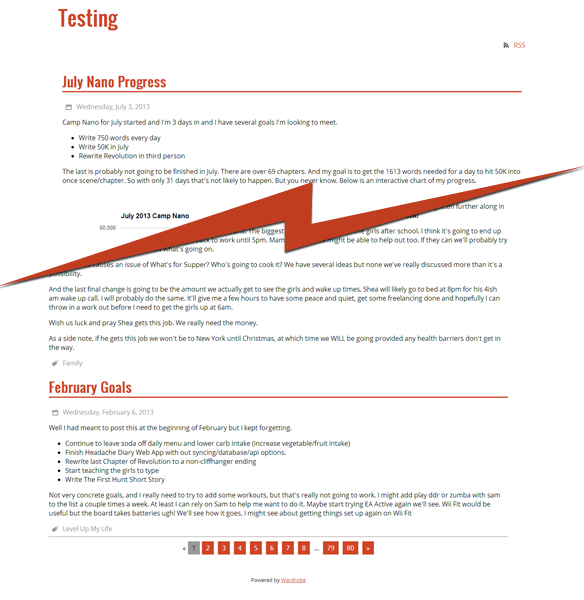

# Wardrobe Theme

A basic responsive HTML5 theme using SCSS and Compass to create an easily modifiable theme.

## To install

* Drop ```basic``` folder into ```public/themes/```
* Change ```app\config\packages\wardrobe\core\wardrobe.php``` to ```'theme' => 'basic'```

## Screeshot

